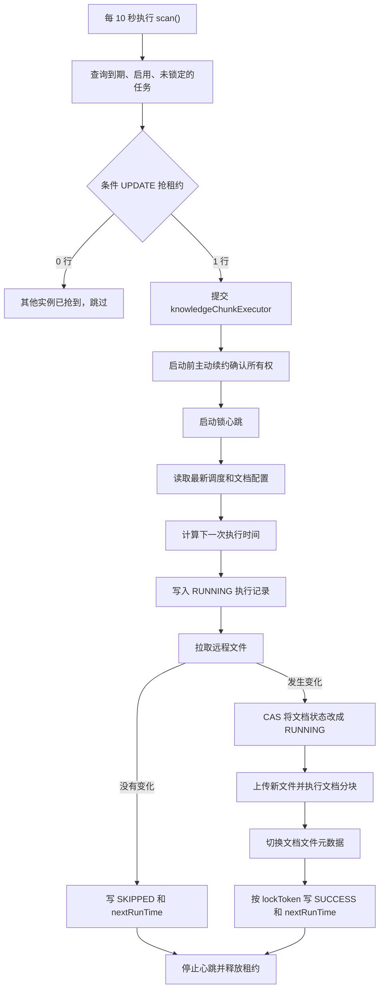

# KnowledgeDocumentScheduleJob-scan方法的数据库租约锁与扫描流程

`KnowledgeDocumentScheduleJob.scan()` 的锁，本质上是一个基于数据库行的“带过期时间的分布式租约锁”。它不是 Java 的 `synchronized`，也不是 Redis/Redisson 锁，更不是长事务持有的数据库行锁。

核心代码位于 [KnowledgeDocumentScheduleJob.java](/Users/liuzekuan/devTools/idea_workspace/ragent/rag/src/main/java/com/nageoffer/ai/ragent/knowledge/schedule/KnowledgeDocumentScheduleJob.java:64) 和 [ScheduleLockManager.java](/Users/liuzekuan/devTools/idea_workspace/ragent/rag/src/main/java/com/nageoffer/ai/ragent/knowledge/schedule/ScheduleLockManager.java:56)。

**一、为什么需要这个锁**

`scan()` 默认每 10 秒执行一次：

```java
@Scheduled(fixedDelayString = "${rag.knowledge.schedule.scan-delay-ms:10000}")
```

但它不会同步执行文档刷新，而是把任务提交给线程池后立即返回：

```java
knowledgeChunkExecutor.execute(() -> scheduleRefreshProcessor.process(lease));
```

因此可能出现三种并发：

- 同一个应用的下一轮扫描，发现上一轮任务还没完成。
- 一个应用内的多个线程同时处理文档。
- 部署多个应用实例后，每个实例都会执行 `scan()`。

锁的目标是：同一个 `scheduleId` 在正常情况下只能由一个线程或实例处理。

---

**二、锁对应的数据库字段**

调度表定义在 [schema_pg.sql](/Users/liuzekuan/devTools/idea_workspace/ragent/resources/database/schema_pg.sql:251)：

```sql
lock_owner VARCHAR(128),
lock_until TIMESTAMP
```

含义分别是：

- `lock_owner`：当前租约的唯一持有者标识。
- `lock_until`：租约失效时间。

一次租约还会在 JVM 中表示为：

```java
public record ScheduleLockLease(
    String scheduleId,
    String lockToken
) {}
```

`lockToken` 类似：

```text
kb-schedule-hostname-instanceUUID:taskUUID
```

既能区分应用实例，也能区分同一实例中的不同执行批次。

---

**三、scan() 的候选查询不是加锁**

`scan()` 首先查询：

```sql
SELECT *
FROM t_knowledge_document_schedule
WHERE enabled = 1
  AND (next_run_time IS NULL OR next_run_time <= :now)
  AND (lock_until IS NULL OR lock_until < :now)
ORDER BY next_run_time
LIMIT 20;
```

对应 [KnowledgeDocumentScheduleJob.java](/Users/liuzekuan/devTools/idea_workspace/ragent/rag/src/main/java/com/nageoffer/ai/ragent/knowledge/schedule/KnowledgeDocumentScheduleJob.java:67)。

这里仅仅是在找“看起来可以执行”的候选任务，不保证当前实例真正获得了任务。

例如实例 A、B 同时扫描，它们完全可能查询到相同的 20 条数据。这是有意设计的，真正的竞争发生在下一步条件更新。

---

**四、真正的抢锁操作**

`tryAcquire()` 大致执行：

```sql
UPDATE t_knowledge_document_schedule
SET lock_owner = :newToken,
    lock_until = :currentTime + 900秒
WHERE id = :scheduleId
  AND (lock_until IS NULL OR lock_until < :scanTime);
```

代码见 [ScheduleLockManager.java](/Users/liuzekuan/devTools/idea_workspace/ragent/rag/src/main/java/com/nageoffer/ai/ragent/knowledge/schedule/ScheduleLockManager.java:56)。

数据库会保证一条 `UPDATE` 的条件判断和修改具有原子性：

```text
实例 A：UPDATE 成功，影响 1 行，拿到租约
实例 B：UPDATE 失败，影响 0 行，放弃任务
```

它不需要在整个任务期间持有数据库事务。数据库行锁只在这条 `UPDATE` 执行期间短暂存在，之后靠 `lock_owner + lock_until` 表示逻辑锁状态。

---

**五、为什么同时需要 owner 和 until**

只有 `lock_owner` 不够。

假设实例 A 抢锁后突然宕机，它将永远没有机会主动解锁，任务会永久卡死。因此需要：

```text
lock_until = 当前时间 + TTL
```

默认配置在 [application.yaml](/Users/liuzekuan/devTools/idea_workspace/ragent/bootstrap/src/main/resources/application.yaml:131)：

```yaml
scan-delay-ms: 10000
lock-seconds: 900
batch-size: 20
```

即默认租约为 15 分钟。即使实例 A 崩溃，15 分钟后其他实例仍可重新抢占。

但只有 `lock_until` 也不够。假设：

1. A 的租约过期。
2. B 抢到任务。
3. A 从长时间暂停中恢复。
4. A 执行自己的 `release()`。

如果解锁只按 `scheduleId` 更新，A 会把 B 的新锁删除。因此解锁必须同时匹配 token：

```sql
UPDATE t_knowledge_document_schedule
SET lock_owner = NULL,
    lock_until = NULL
WHERE id = :scheduleId
  AND lock_owner = :myToken;
```

代码见 [ScheduleLockManager.java](/Users/liuzekuan/devTools/idea_workspace/ragent/rag/src/main/java/com/nageoffer/ai/ragent/knowledge/schedule/ScheduleLockManager.java:82)。

所以旧任务无法续约、修改调度状态或释放新任务的锁。

---

**六、心跳续租**

文档拉取和分块可能超过 15 分钟，所以任务启动后会创建心跳：

```java
heartbeatExecutor.scheduleWithFixedDelay(...)
```

默认 `lockSeconds = 900` 时，心跳间隔被限制为 60 秒。计算规则是：

```text
max(5秒, min(TTL / 3, 60秒))
```

每次心跳执行：

```sql
UPDATE t_knowledge_document_schedule
SET lock_until = 当前时间 + TTL
WHERE id = :scheduleId
  AND lock_owner = :myToken;
```

如果影响 0 行，说明锁已经被其他执行者接管，当前任务会标记为 `lost`。

心跳只是延长租约，不会改变 `lock_owner`。相关代码见 [ScheduleLockManager.java](/Users/liuzekuan/devTools/idea_workspace/ragent/rag/src/main/java/com/nageoffer/ai/ragent/knowledge/schedule/ScheduleLockManager.java:95)。

---

**七、一次完整扫描任务流程**



处理主体见 [ScheduleRefreshProcessor.java](/Users/liuzekuan/devTools/idea_workspace/ragent/rag/src/main/java/com/nageoffer/ai/ragent/knowledge/schedule/ScheduleRefreshProcessor.java:66)。

以某个 URL 文档为例：

1. 调度记录的 `next_run_time = 10:00:00`。
2. 10:00:03，实例 A 和 B 都扫描到该记录。
3. A 的条件更新影响 1 行，写入 `token-A` 和锁到期时间。
4. B 的条件更新影响 0 行，直接跳过。
5. A 将任务提交到 `knowledgeChunkExecutor`。
6. 工作线程启动时先主动续约，防止任务在线程池中排队太久导致租约失效。
7. 启动每 60 秒一次的心跳。
8. 读取最新文档配置，根据 Cron 计算下一次时间，例如 10:05:00。
9. 插入一条 `RUNNING` 执行记录。
10. 使用上次保存的 ETag、Last-Modified 和内容哈希拉取远程文件。
11. 文件没变化则记录 `SKIPPED`；有变化则尝试领取文档运行权。
12. 完成上传、解析、分块、向量写入和文件元数据切换。
13. 只有 `lock_owner = token-A` 时，才能更新调度记录为 `SUCCESS` 并写入 10:05:00。
14. 停止心跳，按 `token-A` 释放租约。

---

**八、文档状态是第二层锁**

调度租约锁保护的是 `scheduleId`，但系统还可能存在用户手动分块。因此处理器还会执行文档状态 CAS：

```sql
UPDATE t_knowledge_document
SET status = 'RUNNING'
WHERE id = :docId
  AND status <> 'RUNNING'
  AND enabled = 1
  AND deleted = 0;
```

代码见 [DocumentStatusHelper.java](/Users/liuzekuan/devTools/idea_workspace/ragent/rag/src/main/java/com/nageoffer/ai/ragent/knowledge/schedule/DocumentStatusHelper.java:42)。

两层保护的职责不同：

- 调度租约：避免同一调度被多个扫描实例重复消费。
- 文档状态 CAS：避免定时刷新和手动分块同时操作同一文档。

---

**九、锁丢失后的保护**

所有调度主状态写回都会附带：

```sql
WHERE id = :scheduleId
  AND lock_owner = :myToken
```

见 [ScheduleStateManager.java](/Users/liuzekuan/devTools/idea_workspace/ragent/rag/src/main/java/com/nageoffer/ai/ragent/knowledge/schedule/ScheduleStateManager.java:206)。

所以旧执行者即使继续运行，也不能覆盖新执行者写入的：

- `next_run_time`
- `last_status`
- `last_error`
- ETag、Last-Modified、内容哈希

但这个 token 不是严格意义上的单调递增 fencing token，外部文件存储、分块和向量服务也不识别它。因此该设计提供的是“调度状态防覆盖”，不能保证外部副作用严格 exactly-once。整体语义更接近 at-least-once。

---

**十、当前实现存在的竞争窗口**

最值得注意的是：候选查询检查了 `enabled` 和 `next_run_time`，但 `tryAcquire()` 只重新检查了锁，没有重新检查任务是否仍然到期。

可能出现：

```text
A、B 同时查询到任务
A 抢锁成功
A 很快执行完成，更新 next_run_time，并释放锁
B 随后才执行 tryAcquire
B 看到 lock_until=NULL，于是也抢锁成功
```

此时 B 使用的是旧候选结果，即使 `next_run_time` 已经被 A 更新到未来，也仍会执行一次。通常 ETag/哈希会让第二次任务变成 `SKIPPED`，但仍会产生额外远程请求和执行记录。

更严谨的抢锁条件应同时包含：

```sql
AND enabled = 1
AND (next_run_time IS NULL OR next_run_time <= :now)
AND (lock_until IS NULL OR lock_until < :now)
```

另外，时间来自各应用实例的 JVM，而不是数据库 `CURRENT_TIMESTAMP`，所以多节点时钟偏差也会影响锁过期判断。生产环境至少需要保证 NTP 同步，进一步可以统一使用数据库时间。

总体来看，这套设计对实例宕机、重复解锁、状态覆盖和长任务续租处理得比较完整；主要缺口是“查询候选”和“抢租约”之间没有再次验证任务到期条件，因此不能完全避免重复领取。